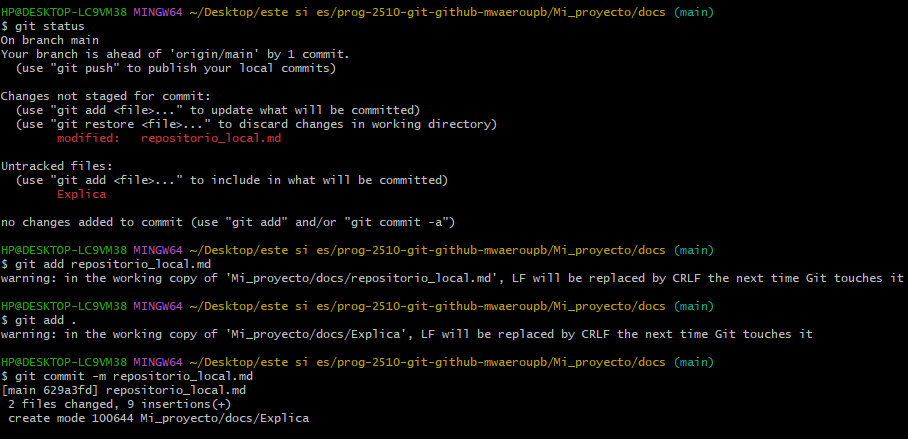

 # Crear un repositorio remoto en GitHub y sincronizarlo

1. **Crear un repositorio en GitHub**
   - Ve a [GitHub](https://github.com) y accede a tu cuenta.
   - Haz clic en el botón verde "New" para crear un nuevo repositorio.
   - Asigna un nombre al repositorio y haz clic en "Create repository".

2. **Vincular el repositorio remoto con el local**
   - Copia la URL del repositorio en GitHub (por ejemplo: `https://github.com/usuario/repositorio.git`).
   - Abre la terminal en tu directorio de trabajo local y ejecuta el siguiente comando para agregar el repositorio remoto:
     ```bash
     git remote add origin <url-del-repositorio>
     ```

3. **Subir el repositorio local al remoto**
   - Si es la primera vez que subes el contenido, usa el siguiente comando para empujar tus cambios:
     ```bash
     git push -u origin main
     ```
   - Si trabajas en una rama diferente a `main`, reemplázala con el nombre de tu rama.
 

4. **Verificar la conexión remota**
   - Para confirmar que el repositorio remoto está vinculado correctamente:
     ```bash
     git remote -v
     ```

5. **Sincronizar cambios (push y pull)**
   - Para subir cambios a GitHub:
     ```bash
     git push origin main
     ```
   - Para descargar cambios desde GitHub:
     ```bash
     git pull origin main
     ```


